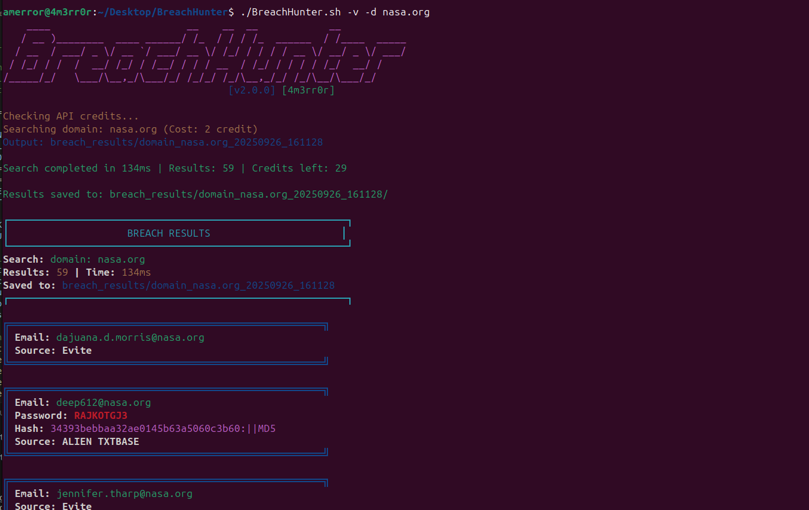

# BreachHunter

BreachHunter is a powerful OSINT (Open Source Intelligence) tool designed for cybersecurity professionals, investigators, and ethical hackers to efficiently search for leaked data using the DeHashed API.

## Features

- **Comprehensive Search Capabilities**: BreachHunter allows users to search for leaked data using various criteria such as email addresses, passwords, names, usernames, IP addresses, hashed passwords, hash types, VINs, addresses, and phone numbers.
- **Rich Data Retrieval**: Retrieve detailed information associated with the queried data, including IP addresses, usernames, names, email addresses, hashed passwords, hash types, passwords, phone numbers, VINs, and addresses.
- **Efficient Output Management**: BreachHunter outputs search results to separate files for easy organization and analysis, enhancing workflow efficiency.
- **Error Handling**: The script includes robust error handling mechanisms to validate API key and email credentials, ensuring smooth operation and preventing unauthorized access.

## Prerequisites

Before using BreachHunter, ensure you have:

- **DeHashed API Key**: Sign up for a DeHashed account and obtain a valid API key.
- **Registered Email**: Use a registered email associated with your DeHashed account.

## Installation

1. Clone the repository:

    ```bash
    git clone https://github.com/4m3rr0r/BreachHunter.git
    ```

2. Navigate to the project directory:

    ```bash
    cd BreachHunter
    ```

3. Make the script executable:

    ```bash
    chmod +x BreachHunter.sh
    ```
4. Usage
     ```bash
    ./BreachHunter.sh -h
    ```

    ```bash
    Options
    -h or --help: Display the help menu.
    -v or --version: Show the program's version number and exit.
    -e or --email: Specify the email.
    -p or --password: Specify the password.
    -n or --name: Specify the name.
    -u or --username: Specify the username.
    -ip or --ip_address: Specify the IP address.
    -H or --hashed_password: Specify the hashed password.
    -ha or -Ha or --hash_type: Specify the hash type.
    -vi or -VI or --vin: Specify the VIN.
    -a or -A or --address: Specify the address.
    -ph or -PH or --phone: Specify the phone number.
    ```
Examples
Search for data associated with an email:
    
    
    ./BreachHunter.sh -e demo@example.com -f output_directory
    
Search for data associated with a hashed password:
   
    
    ./BreachHunter.sh -H <hashed_password> -f output_directory
    


License
This project is licensed under the MIT License - see the LICENSE file for details.
